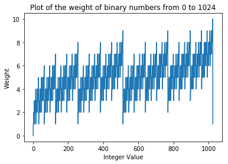

# **DS4300 (SP2020) - HW4: Learning Scala**
*Repo Name: ds4300-hw4*

*By: Arunima Prasad*

-----

### Q1. Reading CSV Explanation
Method 1:
``` scala
val nulls = Array[Int](0, 0, 0, 0)
for (line <- Source.fromFile(filename).getLines) {
 val toks = line.split(",", -1)
 for (i <- 0 until toks.length)
 if (toks(i) == "") nulls(i) = nulls(i) + 1
}
println(nulls.mkString(","))
```
Method 2:
``` scala
val nulls = Source.fromFile(filename).getLines
 .map(_.split(",", -1)).map(a => a.map(z => if (z == "") 1 else 0))
 .reduce((x, y) => (x zip y).map { case (u, v) => u + v })
println(nulls.mkString(","))
```
The second method starts by reading the given file, and splitting it into lines. The first map then splits each line at the comma-delimator, resulting in list of values. The next series of maps then takes each of these lists, and replaces null values (represented as "" in a csv) with 1s, and non-null values with 0. The reduce function then converts the list of 1s and 0s into a single null-count, by adding up the values for each column. The final line prints the result.

This is contrary to the first method, which starts by assuming we know the length of the file (nulls is set to length 4), and uses a loop to count the values, and while going through each column keeps adding to nulls(i) when another null value is found.

### Q2. Binary
Implementation for this part can be found in `/src/Binary.scala`.

The 32-bit binary for 1,234,567,890 is **`01001001100101100000001011010010`**, with a weight of 12.

A plot of weights of binary numbers between 0 and 1024 can he seen below, and found in `refs/Binary0to1024WeightPlot.png`.



*Note: I was unable to get breeze to work directly using Scala, and therefore this plot was created using the matplotlib package in Python.*

### Q3. Partitioned Records
Implementation for this part can be found in `/src/Partition.scala`.

**99.61%** of records be re-assigned to a new node if 1000000
records were re-partitioned from 100 to 107 nodes.

-----

### Q4. Basic Redis Implementation Using Scala
Implementation for this part can be found in `/src/Redis.scala`. Assumptions and invariants are listed in the commented documentation in the code. Basic tests (using print statements) of the redis functionality can be found in the `TestRedis`. The "tests" are currently commented out.

### Q5. Graph Database Using Redis Implementation
Implementation for this part can be found in `/src/Graph.scala`. Assumptions and invariants are listed in the commented documentation in the code.

**The shortest path from X to Y is (X, J, R, Y)**, and can be found by running `TestGraph` in the file referenced above. The shortest path function uses a version of Djiktra's algorithm, and is defined in a private helper function for clarity.
